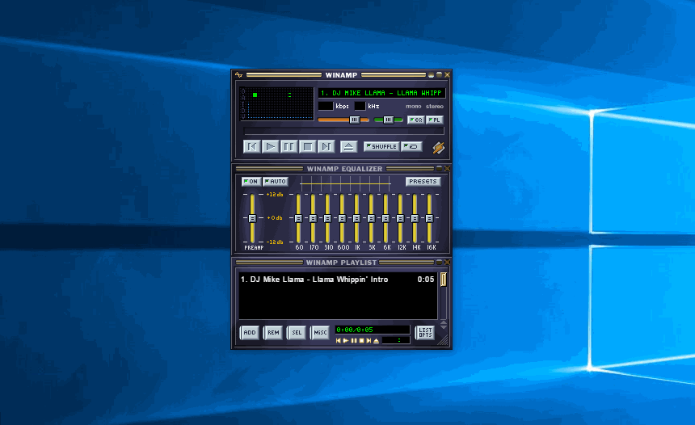

# Winamp2-js for desktop

Unnoficial application based on [Winamp2-js](https://github.com/captbaritone/winamp2-js) - "A reimplementation of Winamp 2.9 in HTML5 and JavaScript.".

[](https://github.com/durasj/winamp2-js-desktop)

## Downloads
- Windows - portable 64-bit
- Linux - AppImage 64-bit, deb 64-bit
- MacOS X - dmg 64-bit

## Developing

### Prerequisites

Assuming you have and know [node.js](https://nodejs.org/en/), make sure you have the latest [yarn](https://yarnpkg.com/lang/en/) and [typescript](https://www.typescriptlang.org/) installed:

```
npm -g i yarn typescript
```

### Installing

Install dependencies and run the start script:

```
yarn
yarn start
```

After the build has completed, you should see one window with the app and one with developer tools. To try some changes, you can: change the code in the `./src` dir, close the current window and run the `yarn start` again.

## Disclaimer
Not affiliated with the [Winamp](http://www.winamp.com/). All product names, logos, and brands are property of their respective owners.